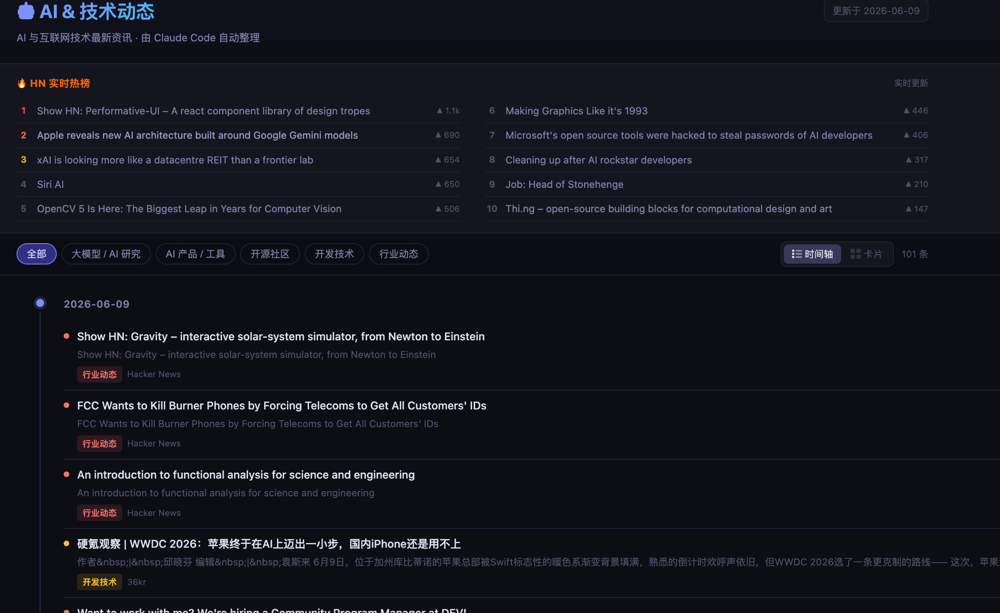

# 🤖 AI & 技术动态

> 自动聚合 AI 与互联网技术最新资讯，由 Claude Code 驱动

**🌐 在线访问：[https://climb0516.github.io/tech-news/](https://climb0516.github.io/tech-news/)**

---

## 截图

**时间轴视图** — 紧凑列表，快速扫读



**卡片视图** — 精选封面 + 全部资讯分区展示


---

## 功能特性

- **AI 精选**：通过 `/go-tech-news` Skill 调用 Claude 搜索、筛选、摘要，写入数据库
- **自动爬虫**：每天 09:00（北京时间）自动抓取 6 个数据源，任何推送也会触发一次
- **HN 实时热榜**：页面顶部展示 Hacker News 当前热榜，带排名和热度分，实时拉取
- **双视图切换**：时间轴（紧凑列表，快速扫读）/ 卡片（带封面图，精读）
- **分类筛选**：大模型 / AI 研究、AI 产品 / 工具、开源社区、开发技术、行业动态
- **有图 / 无图分区**：卡片视图自动将有封面的资讯与纯文字资讯分区展示

---

## 技术架构

```
Claude Code (Skill)
  ↓ WebSearch 搜索 + AI 摘要
  ↓ 写入 Supabase (type='ai')
  ↓ git push last_ai_update.txt
       ↓
GitHub Actions (触发条件：定时 / push / 手动)
  ↓ 运行 scraper.py
  ↓ 抓取 6 个数据源
  ↓ 写入 Supabase (type='scraped')
       ↓
GitHub Pages (index.html)
  ↓ 前端直连 Supabase REST API
  ↓ 实时渲染页面
```

---

## 数据来源

| 来源 | 类型 | 说明 |
|------|------|------|
| Hacker News | 爬虫 + 实时热榜 | Algolia HN API |
| Dev.to | 爬虫 | REST API，含封面图 |
| GitHub Trending | 爬虫 | 每日热门仓库 |
| arXiv cs.AI | 爬虫 | AI 论文 RSS |
| 36kr | 爬虫 | RSS |
| InfoQ | 爬虫 | RSS |
| Claude WebSearch | AI 精选 | 手动触发，质量更高 |

---

## 数据库

使用 **Supabase** PostgreSQL，表结构：

```
news_items
├── id           bigint (主键)
├── category     text   (A-E 分类)
├── title        text   (唯一，用于去重)
├── source       text
├── summary      text
├── url          text
├── date         text
├── image_url    text
├── type         text   ('ai' | 'scraped')
└── created_at   timestamptz
```

---

## 本地运行爬虫

```
pip install -r requirements.txt  # 无额外依赖，纯 stdlib
python scraper.py
```

---

## 自动更新机制

| 触发方式 | 时机 |
|---------|------|
| GitHub Actions 定时任务 | 每天 09:00 北京时间 |
| 任意 push 到 main 分支 | 推送后约 1-2 分钟 |
| GitHub Actions 手动 dispatch | 按需触发 |
| `/go-tech-news` Skill | 执行后自动 push 触发爬虫 |
